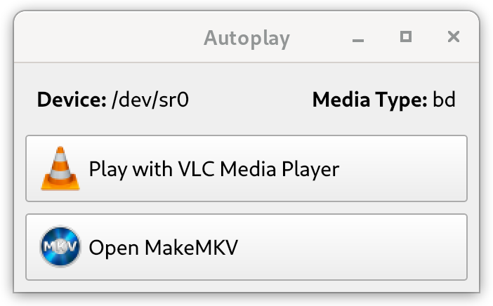

# autoplay
A program that detects CD/DVD/Blu-ray discs and runs a task window for Linux.



For the best experience install all the recommended software:
```shell
sudo apt install -y sound-juicer brasero libbluray-bdj vlc
```

# Build and Install
```shell
mkdir build && cd build
cmake ..
make
sudo make install
```

# Enable and Start Autoplay Service
1. Reload daemon
   ```shell
   sudo systemctl daemon-reload
   ```
2. Enable autoplay to start at login
   - Enable for all users:
     ```shell
     sudo systemctl --global enable autoplay
     ```
   - Enable for only current user:
     ```shell
     systemctl --user enable autoplay
     ```
3. Start autoplay for current user
   ```shell
   systemctl --user start autoplay
   ```
   Alternatively, reboot the system.

